# MicroservicesDemo

[English](README.en.md) | 简体中文

**MicroservicesDemo** 是一个基于 .NET 9 的微服务演示项目，展示 API Gateway 路由、服务发现、事件驱动消息、分布式缓存、可观测性与 Clean Architecture 的整合落地；既支持通过 Docker Compose 在本地运行，也提供部署在 AKS 上的在线演示环境。

## 🌐 在线体验

无需在本地启动 Docker Compose，可直接访问部署在 AKS 上的 [MicroservicesDemo 在线演示](https://250669.xyz/)。

在线演示通过 IdentityServer 提供安全认证，支持登录、创建账号和中英文切换；认证完成后即可进入 Admin Web。

> **邮箱验证提示：** 注册后，验证邮件通常需要 2–5 分钟送达。若收件箱中暂未看到，请检查垃圾邮件或广告邮件目录；由于发信域名注册时间较短，部分邮件服务商可能会暂时将验证邮件归类为垃圾邮件。

在线环境同时提供以下可观测性入口：

- [Grafana Dashboard](https://grafana.250669.xyz/dashboards)：查看应用与基础设施的监控 Dashboard、指标和日志。
- [Jaeger UI](https://jaeger.250669.xyz/)：查询分布式 Trace，分析请求经过 Admin Web、API Gateway、后端服务及依赖组件的完整调用链路。

## 📖 快速导航

- [在线体验](#-在线体验)
- [项目亮点](#-项目亮点)
- [架构](#️-架构图)
- [快速启动](#-快速启动)
- [常见问题](#-常见问题)
- [截图与证据说明](#️-截图与证据说明)
- [参与贡献](#-参与贡献)
- [许可证](#-许可证)

## 项目速览

- 一个可本地运行的 .NET 9 微服务示例，串联 Ocelot 网关路由、本地 Consul 服务发现、RabbitMQ 异步消息、Redis 缓存与全链路可观测性；AKS 部署使用 Kubernetes Service DNS，不依赖 Consul。
- 展示从 Next.js 管理台登录，经 Duende IdentityServer 与 Ocelot 网关访问 PostgreSQL、Redis、RabbitMQ 和 Azure Service Bus 的受保护链路。
- 提供覆盖 dev、qa、staging、uat、prod 的 AKS 清单与流水线。
- 通过 Jaeger、Grafana、Loki 与 Alertmanager 截图展示 Trace、Metric、Log 与告警链路。

## ⚙️ 技术栈

**🧩 后端** &nbsp;


<br>

**🖥️ 前端** &nbsp;


<br>

**🗄️ 基础设施** &nbsp;


<br>

**🔍 可观测性** &nbsp;


<br>

**🧪 测试** &nbsp;


## 🔄 CI/CD 状态

[](https://dev.azure.com/lambdazb/MicroservicesDemo/_build/latest?definitionId=2&branchName=dev)
[](https://dev.azure.com/lambdazb/MicroservicesDemo/_build/latest?definitionId=9&branchName=dev)
[](https://dev.azure.com/lambdazb/MicroservicesDemo/_build/latest?definitionId=5&branchName=dev)
[](https://dev.azure.com/lambdazb/MicroservicesDemo/_build/latest?definitionId=3&branchName=dev)
[](https://dev.azure.com/lambdazb/MicroservicesDemo/_build/latest?definitionId=1&branchName=dev)
[](https://dev.azure.com/lambdazb/MicroservicesDemo/_build/latest?definitionId=4&branchName=dev)

以上徽章动态展示各流水线在 `dev` 分支上的最新运行状态；点击徽章可进入对应的 Azure Pipeline。应用流水线负责构建镜像、推送至 ACR 并部署到 AKS。平台流水线负责基础设施、Ingress 与集群附加组件。

| 类型 | 流水线定义 |
| --- | --- |
| 应用 | [Products Microservice](aks/pipelines/azure-pipelines-products-microservice.yaml) · [API Gateway](aks/pipelines/azure-pipelines-apigateway.yaml) · [IdentityServer](aks/pipelines/azure-pipelines-identityserver.yaml) · [Test Microservice](aks/pipelines/azure-pipelines-test-microservice.yaml) · [Admin Web](aks/pipelines/azure-pipelines-admin-web.yaml) |
| 平台 | [Infrastructure](aks/pipelines/azure-pipelines-infrastructure.yaml) · [Ingress](aks/pipelines/azure-pipelines-ingress.yaml) · [Cluster Add-ons](aks/pipelines/azure-pipelines-cluster-addons.yaml) |

## ✨ 项目亮点

| # | 亮点 | 说明 |
| --- | --- | --- |
| 1 | **AI 工具链辅助开发** | 在 `.github/` 下维护 agents、skills 与 `mcp-config.json`，同时沉淀 C# 测试生成与前端 UI 规范等复用能力 |
| 2 | **环境适配的服务发现** | 本地 Docker Compose 使用 Consul 动态注册与发现；AKS 环境使用 Kubernetes Service DNS 与 ClusterIP 路由，不部署或依赖 Consul |
| 3 | **RabbitMQ 事件驱动通信** | 产品新增事件通过 RabbitMQ 异步发布，Test Service 作为消费者处理；服务间通信不再强耦合 |
| 4 | **Redis 缓存 + Decorator 模式** | 基于 Scrutor 的装饰器链把缓存层、遥测层与核心业务层分开，读取场景显著减少数据库直连压力 |
| 5 | **PostgreSQL + EF Core 数据持久化** | 通过 Options 模式管理连接配置，支持指数退避重试，可维护性强 |
| 6 | **OpenTelemetry 全链路追踪** | 前端到网关再到后端与基础设施的完整链路，Trace、Metrics、Logs 统一通过 OTEL Collector 分发 |
| 7 | **Clean Architecture + SOLID + 单元测试** | Products 服务三层分层，依赖方向严格内向；xUnit + Moq 覆盖核心服务用例 |
| 8 | **认证授权与安全会话** | Duende IdentityServer + ASP.NET Core Identity 提供 OIDC/OAuth 2.0 登录、注册、邮箱确认和刷新令牌；网关校验访问令牌与 `products-api` scope，Redis 保存令牌拒绝列表 |
| 9 | **多通道异步消息** | RabbitMQ 负责本地事件演示，Azure Service Bus 承载产品更新主题 |
| 10 | **容器与 AKS 交付** | Azure Pipelines 构建服务镜像并推送至 Azure Container Registry（ACR），随后使用 `aks/` 中的多环境 Kubernetes 清单部署到 AKS；流水线同时覆盖基础设施、Ingress 与集群附加组件 |
| 11 | **生产级密钥管理** | Azure DevOps Variable Groups 关联 Azure Key Vault 获取敏感配置，部署流水线将其同步为各环境的 Kubernetes Secrets，应用通过 `secretKeyRef` 注入运行时配置 |

## 🏗️ 架构图

<p align="center">
  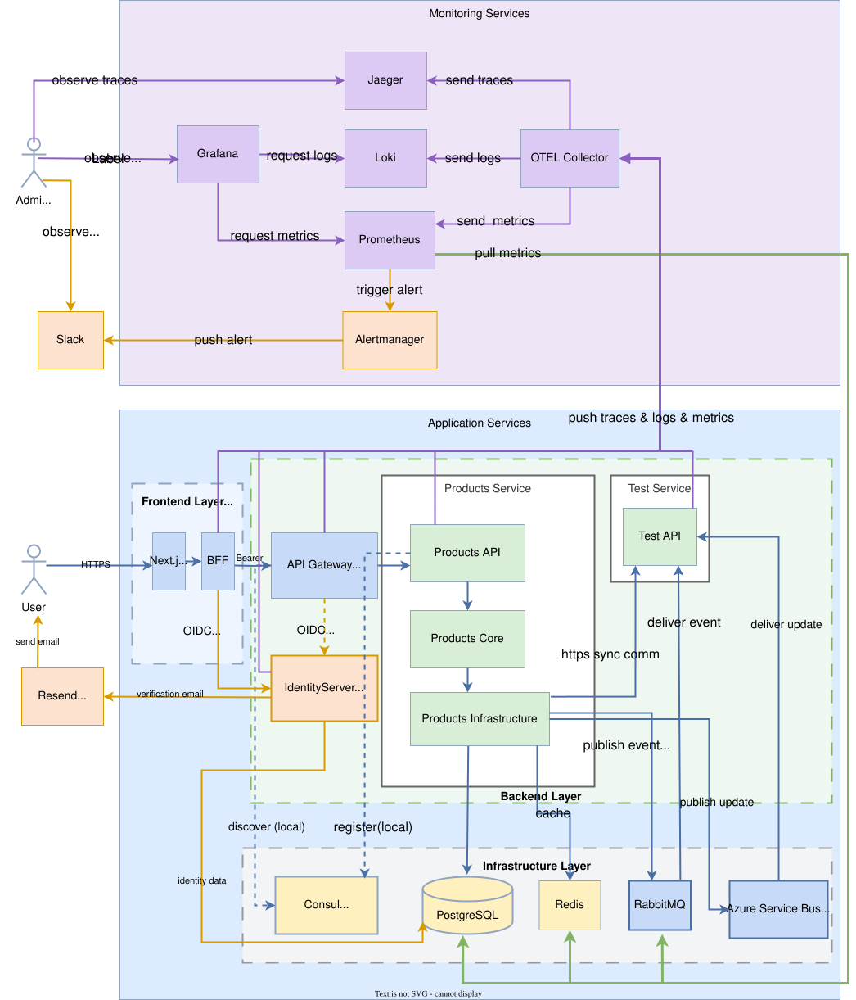
</p>

**请求路径**：Browser → Admin Web → IdentityServer (OIDC) → API Gateway (Ocelot) → Products API / Test API → PostgreSQL / Redis

**消息路径**：Products API → RabbitMQ / Azure Service Bus → Test API

**Products 与 Test 服务通信**：

- **同步通信（删除产品）**：Products Service 删除产品后，由 Products Infrastructure 通过 HTTP 调用 Test API，删除对应的产品关联信息。
- **异步通信（新增产品）**：Products Service 将 `products.add` 事件发布到 RabbitMQ，Test API 从绑定队列消费并处理该事件。
- **异步通信（更新产品）**：Products Service 将 `product.update` 事件发布到 Azure Service Bus Topic，Test API 通过 Subscription 消费并处理该事件。消息进入 Dead-letter Queue（DLQ）时触发告警，由运维人员检查并人工处理 DLQ 中的消息。

**可观测路径**：所有服务 → OTEL Collector → Jaeger (Trace) / Prometheus (Metrics) / Loki (Logs) → Grafana

### 🔐 认证与请求链路

`Next.js UI` 与 `BFF` 是同一个 Admin Web 部署中的逻辑组件，并非两个独立服务。BFF 在服务端维护 NextAuth Session 和令牌，因此浏览器无需直接持有 Access Token 或调用 API Gateway。

| 关系 | 说明 |
| --- | --- |
| `Next.js UI → BFF` | 浏览器通过同源 HTTPS 调用 Next.js API Route |
| `BFF → API Gateway` | BFF 从服务端 Session 读取 Access Token，并以 Bearer Token 代理 API 请求 |
| `Admin Web / Browser ↔ IdentityServer` | 未登录时由 Admin Web 发起 OIDC 登录并重定向浏览器；用户在 IdentityServer 完成注册与邮箱确认、登录；BFF 处理回调、Token 换取、Token 刷新与登出 |
| `API Gateway ⇢ IdentityServer` | 网关获取并缓存 OIDC Metadata/JWKS，在本地校验 JWT 的签名、Issuer、Audience 与有效期 |

图中的实线表示运行时请求或数据流；虚线表示配置发现、信任或可选依赖关系。API Gateway 通常不会为每个业务请求同步调用 IdentityServer。

> **服务发现边界**：Consul 仅用于本地 Docker Compose 演示与开发；部署到 AKS 后，网关通过 Kubernetes Service DNS 访问后端服务，服务注册、寻址与负载均衡由 Kubernetes 提供。

## ⚙️ 技术选型

| 分类 | 技术 | 选型原因 |
| --- | --- | --- |
| Backend | .NET 9, ASP.NET Core, EF Core | 成熟生态，支持 OpenTelemetry 原生集成 |
| Gateway | Ocelot | 轻量级 .NET API Gateway，负责集中路由，让客户端与内部服务解耦 |
| Service Discovery | Consul (本地), Kubernetes Service DNS (AKS) | 本地演示动态注册与发现；AKS 通过 ClusterIP Service 提供稳定 DNS、寻址与负载均衡 |
| Architecture | Clean Architecture, SOLID, Decorator, DI | 依赖边界清晰，Scrutor 支持无侵入装饰器链 |
| Database | PostgreSQL + EF Core | 关系型持久化，Npgsql 原生支持 OTEL |
| Cache | Redis | 减少重复读压力；通过 Decorator 模式透明叠加在业务层之外 |
| Identity | Duende IdentityServer, ASP.NET Core Identity, Resend | OIDC/OAuth 2.0 登录、用户注册、邮箱确认与 API scope 授权 |
| Messaging | RabbitMQ, Azure Service Bus | 异步事件传播与消费幂等，生产者与消费者独立演进 |
| Secrets | Azure Key Vault, Azure DevOps Variable Groups, Kubernetes Secrets | 集中保存敏感配置，并在部署时按环境安全注入 AKS 工作负载 |
| Observability | OpenTelemetry, OTEL Collector, Prometheus, Grafana, Jaeger, Loki, Alertmanager | 三支柱可观测性，从浏览器到基础设施完整覆盖 |
| Frontend | Next.js, React, TypeScript, TanStack Query | 接入 OTEL，前端链路也可追踪 |
| Testing | xUnit, Moq, FluentAssertions, AutoFixture | 轻量可读，符合 .NET 社区主流实践 |
| Delivery | Docker Compose, AKS, Azure Pipelines | 本地可重复环境与 dev/qa/staging/uat/prod 多环境部署资产 |

## 💡 核心功能

**📐 产品管理（Products Service）**

- 产品的增删改查（CRUD），通过 Ocelot Gateway 对外暴露
- 新增产品后通过 RabbitMQ 发布事件，Test Service 异步消费
- 读取链路经过 Redis 缓存，减少直接数据库访问；更新与删除时同步处理缓存失效

**🚀 服务治理（Gateway + Consul / Kubernetes DNS）**

- API Gateway 统一对外，客户端无需感知内部服务地址
- 本地 Docker Compose 中，服务自注册到 Consul，网关按服务名动态发现并路由
- AKS 环境不使用 Consul；网关通过 Kubernetes Service DNS 访问 ClusterIP Service

**🔐 身份认证（IdentityServer + Admin Web）**

- Admin Web 使用 OIDC Authorization Code Flow 登录，并维护服务端会话与令牌刷新
- 支持用户注册、Resend 邮箱确认与 Redis 频率限制；Products 路由要求有效 Bearer Token 和 `products-api` scope
- 登出时将访问令牌加入 Redis 拒绝列表，网关可配置为校验失败时拒绝访问

**📨 消息可靠性（RabbitMQ + Azure Service Bus）**

- RabbitMQ 演示产品新增事件发布/消费，Redis 记录已处理消息以保证消费幂等
- Azure Service Bus 承载产品更新事件

**🔍 可观测性（Observability Stack）**

- 所有服务接入 OpenTelemetry，Trace、Metrics、Logs 三路并行
- Grafana 统一展示指标与日志，可从日志 TraceID 直接跳转至 Jaeger Trace
- Alertmanager 触发告警并推送至 Slack

## 📁 项目结构

```
.github/
  agents/                        # 自定义 agent，例如 C# Expert、Expert React Frontend Engineer
  skills/                        # 自定义 skill，例如 csharp-test-gen、premium-frontend-ui
  mcp-config.json                # MCP Server 配置，例如 filesystem、context7、dockerhub
src/backend/
  Gateway/ApiGateway/          # Ocelot API Gateway，路由规则见 ocelot.json
  IdentityServer/              # OIDC/OAuth 2.0、用户注册、邮箱确认与令牌签发
  Services/Products/           # Products 微服务
    ProductsMicroservice.Core/           # 业务逻辑、接口契约、AutoMapper、Polly 策略
    ProductsMicroservice.Infrastructure/ # EF Core、Redis 缓存、RabbitMQ 发布、Scrutor 装饰器
    ProductsMicroService.API/            # 控制器、中间件、Consul 注册、OTEL 配置
  Services/Test/               # Test 微服务，演示 RabbitMQ 消费
  BuildingBlocks/CommonService/ # 跨服务共用组件：RabbitMQ 基类、TraceContext 中间件
src/frontend/admin-web/        # Next.js 管理台，接入 OTEL
aks/                           # 多环境 Kubernetes 清单与 Azure Pipelines
configs/                       # 监控、告警、日志、数据库配置
docker/                        # 本地开发和演示部署的 Compose 配置
tests/                         # Products 与 IdentityServer 单元测试
```

## 🚀 快速启动

**⚡️ 环境要求**：Docker Desktop，以及可用的 Azure Service Bus Namespace（需预先创建 `products.updates` Topic 和 `products.updates.test` Subscription）。若需在宿主机编译或运行测试，还需安装 .NET 9 SDK 和 Node.js 20+。

**📑 本地开发环境**（首次启动先创建本地配置）：

```powershell
if (-not (Test-Path docker/dev/.env)) { Copy-Item docker/dev/.env.example docker/dev/.env }
# 编辑 docker/dev/.env，替换示例凭据并填写有效的 Service Bus 连接字符串
docker compose --env-file docker/dev/.env -f docker/dev/docker-compose.yml -f docker/dev/docker-compose.override.yml up
```

`docker/dev/.env` 已被 Git 忽略，请勿提交真实密码、Resend API Token 或 Service Bus 连接字符串。IdentityServer 本地开发端口为 `8485`。

**📦 演示部署环境**（拉取预构建镜像）：

```powershell
if (-not (Test-Path docker/deploy/.env)) { Copy-Item docker/deploy/.env.example docker/deploy/.env }
# 编辑 docker/deploy/.env，并配置真实的 IdentityServer .pfx 签名证书路径和密码
docker compose --env-file docker/deploy/.env -f docker/deploy/docker-compose.yml up -d
```

默认拉取 `latest`。如需固定到某次 CI 产物，请在 `docker/deploy/.env` 中将 `PRODUCTS_IMAGE_TAG`、`APIGATEWAY_IMAGE_TAG`、`IDENTITYSERVER_IMAGE_TAG`、`TESTMICROSERVICE_IMAGE_TAG`、`ADMINWEB_IMAGE_TAG` 改为对应的 `sha-<commit>` tag，然后重新启动：

```powershell
docker compose --env-file docker/deploy/.env -f docker/deploy/docker-compose.yml up -d
```

> 演示部署使用 Production 配置，必须提供仓库外生成的 IdentityServer `.pfx` 签名证书；不要把证书或密码提交到 Git。

**🌐 常用访问地址**：

| 服务 | 地址 |
| --- | --- |
| Admin Web | http://localhost:3000 |
| IdentityServer（开发 / 演示部署） | http://localhost:8485 / http://localhost:8085 |
| API Gateway | http://localhost:9080 |
| Jaeger UI | http://localhost:16686 |
| Grafana | http://localhost:13000 |
| Prometheus | http://localhost:9090 |
| Consul UI | http://localhost:8500 |
| RabbitMQ Management(账户/密码：guest) | http://localhost:15672 |

**📄 推荐演示顺序**：

1. 在Postman中导入 [MicroservicesDemo.postman_collection.json](MicroservicesDemo.postman_collection.json)
2. 通过 Admin Web 或 Postman 调用产品接口
3. 在 Jaeger 中查看请求链路（可观察 Redis、RabbitMQ 的 Span）
4. 在 Grafana 中查看指标与日志，通过 TraceID 从日志跳转至 Trace
5. 在 Consul 中确认服务注册，在 RabbitMQ 中查看队列状态

## ❓ 常见问题

1. **Docker Desktop 未启动**
   - 症状：执行 `docker compose up` 或 `docker ps` 时提示无法连接 Docker daemon，或容器始终无法创建。
   - 解决方案：启动 Docker Desktop，确认 Docker Engine 正常运行后重新执行 compose 命令。

2. **端口占用导致 Container 启动失败**
   - 症状：启动时出现 `port is already allocated`、`bind for 0.0.0.0:xxxx failed` 等错误。
   - 解决方案：修改 `docker-compose.yml` 中对应服务的端口映射，避开已占用端口后重新启动。

3. **依赖服务未启动或不健康**
   - 症状：业务容器立即退出，或因 PostgreSQL、Redis、RabbitMQ、Consul 等依赖未就绪而反复重启。
   - 解决方案：配置启动依赖与健康检查，并适当增加重试次数、超时时间和启动宽限期。

4. **Slack Webhook URL 配置不正确**
   - 症状：告警规则已触发，但 Slack 没有收到通知。
   - 解决方案：将有效 Webhook URL 写入 Git 忽略的 `configs/secrets/alertmanager-slack-webhook.txt`，然后重启 Alertmanager。

5. **Grafana Dashboard 的 metric name 与实际不一致**
   - 症状：应用和采集链路正常，但 Dashboard 面板显示 `No data`。
   - 解决方案：在 Prometheus 中确认当前指标名称，并同步更新 Grafana dashboard 查询；OpenTelemetry package 升级可能改变导出的指标名。

6. **RabbitMQ 启动时报 `.erlang.cookie: eacces`**
   - 原因：Docker volume 中残留的权限不一致，容器内 `rabbitmq` 用户无法读写 `.erlang.cookie`。
   - 解决方案：删除 `rabbitmq_data` volume 后重新启动，Docker 会以正确权限重建 volume。

   ```powershell
   docker compose --env-file docker/dev/.env -f docker/dev/docker-compose.yml -f docker/dev/docker-compose.override.yml down
   docker volume rm <your-compose-project-name>_rabbitmq_data
   docker compose --env-file docker/dev/.env -f docker/dev/docker-compose.yml -f docker/dev/docker-compose.override.yml up
   ```

## ✅ 测试与验证

```powershell
dotnet build MicroservicesDemo.sln
dotnet test tests/ProductsServiceUnitTests/ProductsServiceUnitTests.csproj
dotnet test tests/IdentityServerUnitTests/IdentityServerUnitTests.csproj
Set-Location src/frontend/admin-web
npm ci
npm run lint
npm test
npm run build
```

后端测试覆盖产品 CRUD、消息幂等，以及 IdentityServer 的登录、注册、邮箱确认与重发流程；前端使用 ESLint、Vitest 和 Next.js production build 验证。

## 💪 工程能力

- **微服务拆分与分层设计**：明确 Admin Web、API Gateway、Products Service、Test Service 的职责边界；Products 服务严格遵循 Clean Architecture
- **同步与异步通信**：Ocelot 统一同步路由，本地使用 Consul、AKS 使用 Kubernetes Service DNS；RabbitMQ 与 Azure Service Bus 解耦异步链路
- **缓存策略设计**：通过 Scrutor Decorator 链透明叠加 Redis 缓存，并处理更新、删除场景下的缓存失效
- **可观测性方案搭建**：前后端接入 OpenTelemetry，由 OTEL Collector 分发 Trace、Metrics、Logs，Grafana 与 Alertmanager 提供统一观测和告警
- **配置与密钥管理**：Options 模式管理组件配置，Azure Key Vault、Variable Groups 与 Kubernetes Secrets 管理敏感值
- **单元测试与可维护性**：使用 xUnit、Moq、FluentAssertions 与 AutoFixture 覆盖核心行为

## 🎯 后续可扩展方向

- 为 RabbitMQ 增加重试策略与 Dead Letter Exchange，补齐本地消息链路容错
- 引入 Transactional Outbox：在产品数据变更的同一数据库事务中持久化缓存失效事件，由后台任务可靠投递至消息队列，并通过可重试、幂等的消费者删除或重建 Redis 缓存，避免因 Redis 短暂故障或服务重启而永久遗留旧缓存
- 引入 Saga 模式处理跨服务分布式一致性问题

## 🖼️ 截图与证据说明

以下截图展示管理后台、身份邮件、CI/CD、云端资源、AKS 运行状态，以及网关路由、服务发现、链路追踪、指标监控、日志关联、异步消息与告警链路的实际运行结果。

### 🖥️ 管理后台与身份邮件

#### 📦 Products 管理页面

该页面展示登录后的产品工作区，包括库存数量、库存总价值、平均价格，以及产品新增、编辑和删除入口，证明 Admin Web 已与受保护的 Products API 完成集成。

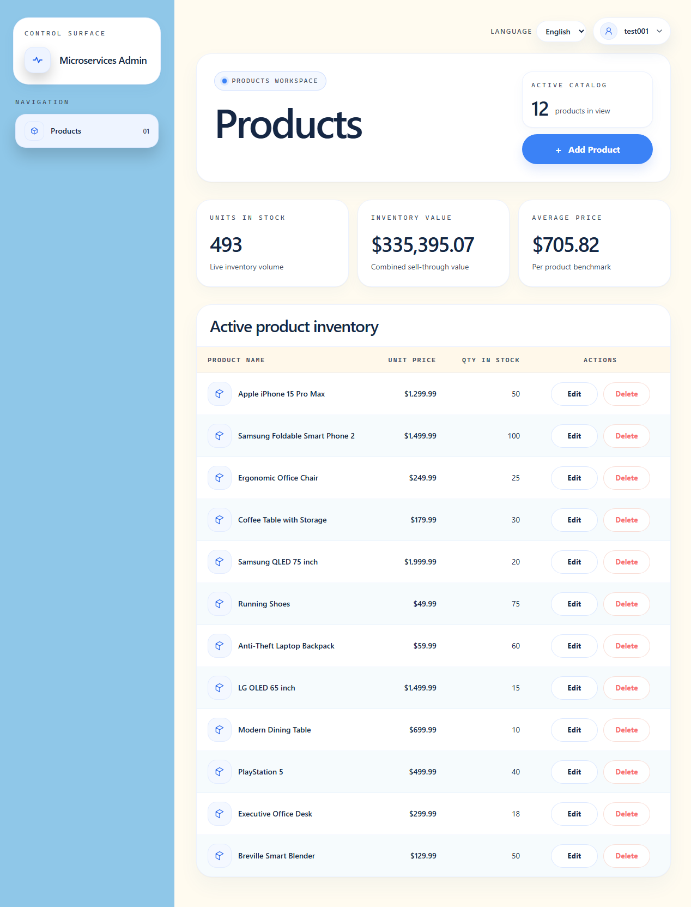

#### ✉️ Resend 邮件投递

Resend 控制台中的投递记录展示中英文账户确认邮件均已成功送达，验证 IdentityServer 注册与邮箱确认链路可用。

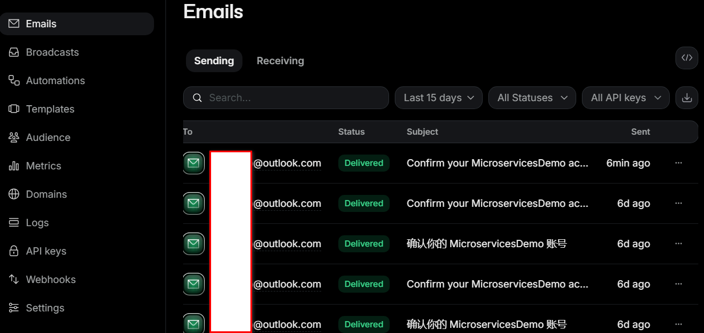

### 🔄 CI/CD 与 Azure 交付证据

#### ✅ Azure Pipelines 运行总览

流水线总览展示 Admin Web、IdentityServer、API Gateway、Products、Test Service、基础设施、Ingress、集群附加组件及消息重处理函数等流水线的成功运行状态。

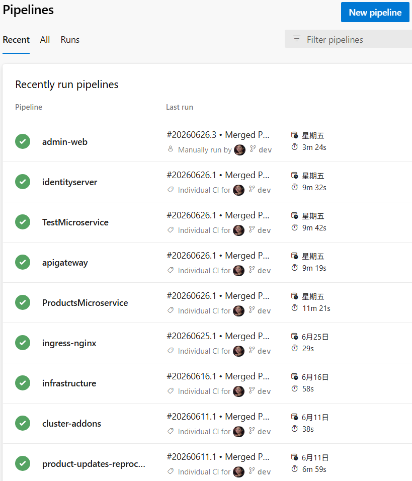

#### 🧪 Products Microservice 流水线

Products 流水线依次完成镜像构建与推送、单元测试和 dev 环境部署；截图同时展示测试通过率、代码覆盖率以及按条件控制的后续环境部署阶段。

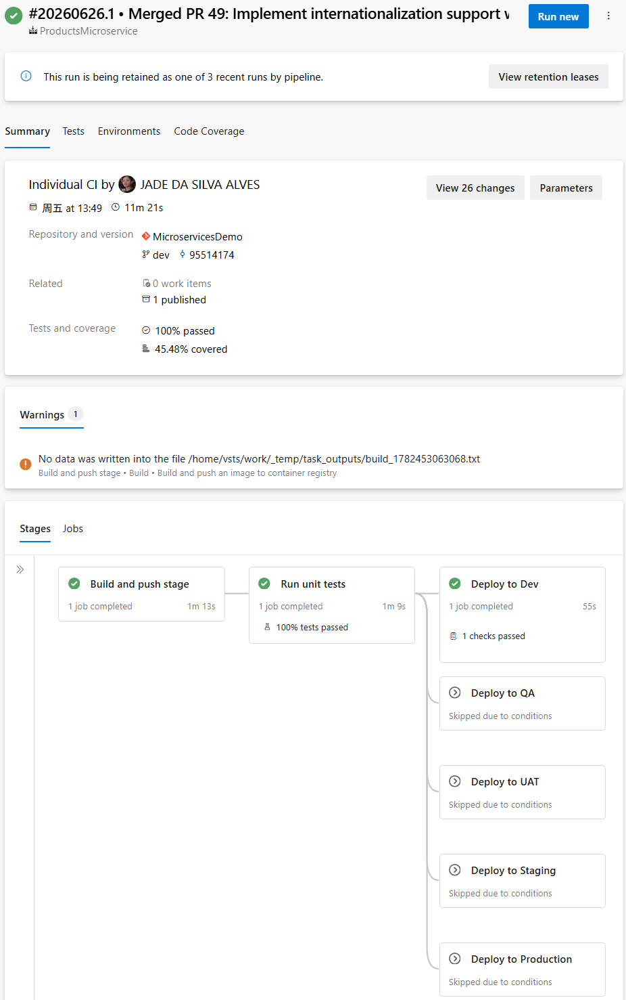

#### 🏗️ 基础设施流水线

基础设施流水线成功完成 dev 环境资源部署，证明 Azure 基础设施定义能够通过独立 Pipeline 重复执行。

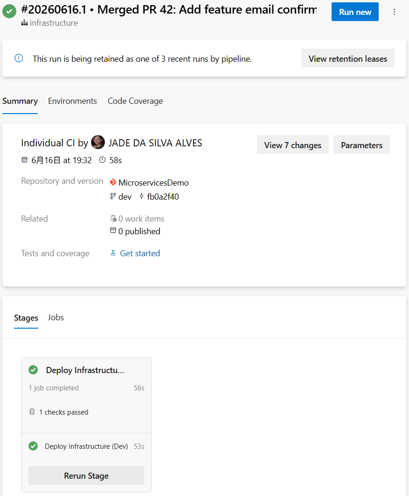

#### 🔐 Azure DevOps Variable Groups

Variable Groups 按应用和职责拆分全局配置与 Key Vault 配置，为不同服务的部署流水线提供集中、可复用的环境变量来源。

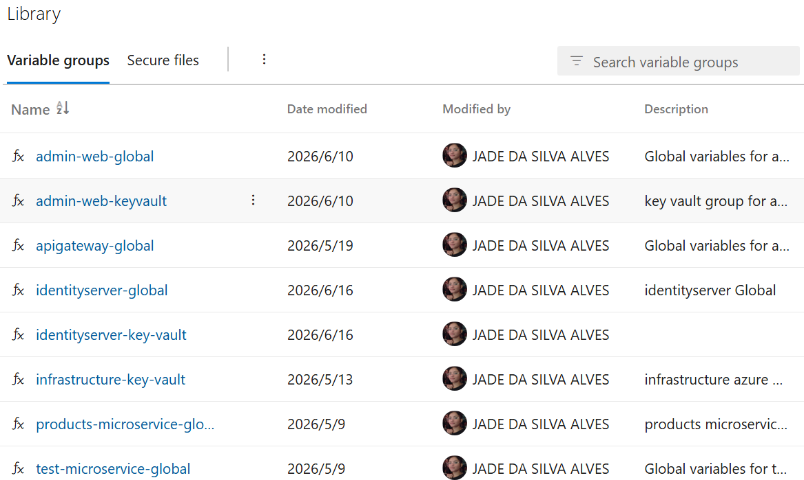

#### 📦 Azure Container Registry

ACR 中已创建 Admin Web、API Gateway、IdentityServer、Products 和 Test Service 镜像仓库，证明应用流水线能够发布各服务的容器镜像。

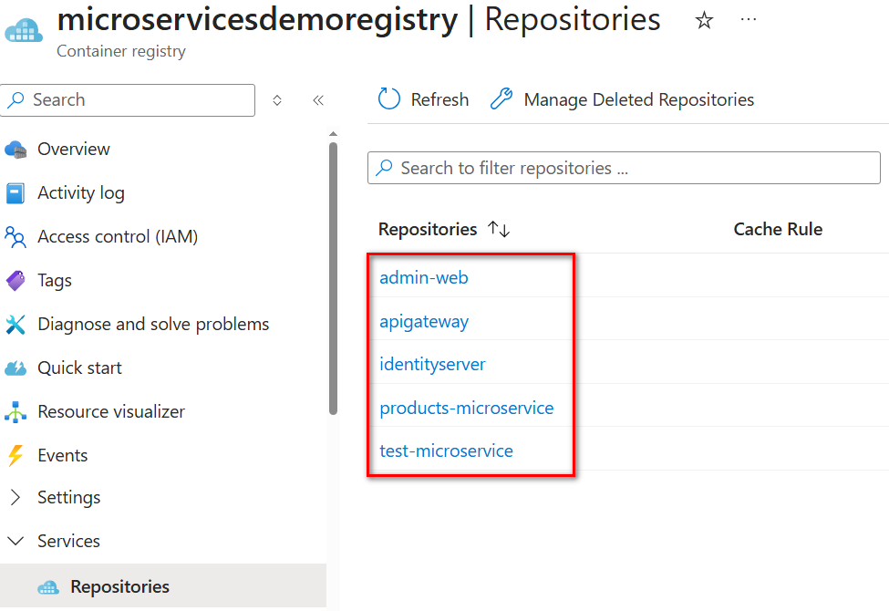

#### 🔑 Azure Key Vault

Key Vault 中的敏感值名称已在截图中遮挡；启用状态证明部署所需密钥由集中式密钥库管理，而非直接写入仓库或流水线定义。

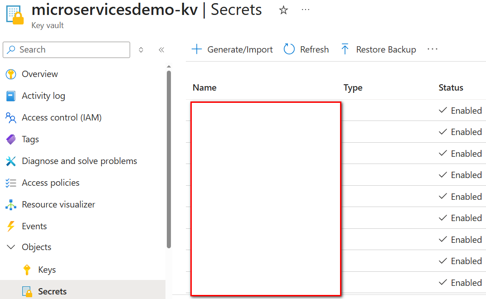

### ☸️ AKS 运行状态

#### 🚀 dev Namespace Pods

`dev` Namespace 中的前端、网关、身份服务、业务服务、数据组件及可观测性组件均处于 `Running` 且容器已 Ready，展示完整环境在 AKS 中的实际部署状态。

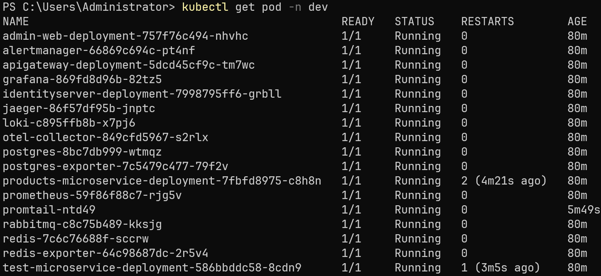

#### 🌐 Nginx Ingress Pod

AKS 应用路由 Namespace 中的 Nginx Pod 处于 `Running` 和 Ready 状态，为外部域名流量提供 Ingress 入口。

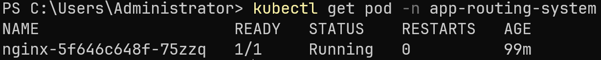

### 🔍 服务发现证据

**看点：** Consul 截图证明本地 Docker Compose 环境已实现动态注册与发现；AKS 部署则使用 Kubernetes Service DNS。


### 🔭 链路追踪、指标与日志

**看点：** Jaeger 截图证明 OIDC 登录、令牌签发以及业务请求已经接入分布式追踪，并展示请求穿过网关、API、Redis 及 RabbitMQ 相关 Span；Grafana 与日志跳转链路证明指标和日志可围绕同一个分布式 Trace 上下文联动排查。

#### 🔐 IdentityServer OIDC 登录流程

该截图展示一次登录操作产生的四段认证 Trace：`POST /Account/Login` 验证用户并建立登录会话，授权回调继续原始 Authorize 请求，Discovery 请求获取 OIDC 元数据，最后由 BFF 调用 Token Endpoint。浏览器前端通道与 BFF 后端通道经过重定向和独立 HTTP 请求，因此在 Jaeger 中显示为多条 Trace。

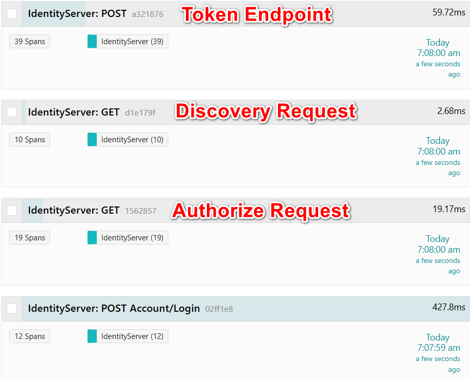

#### 🎫 Authorization Code Token Exchange

Token Endpoint Trace 展示 BFF 使用一次性 Authorization Code 换取 Token 的内部过程：IdentityServer 读取并删除授权码、验证 Client 与 Scope，随后创建 Access Token、Refresh Token 和 Identity Token，并使用签名凭据生成 JWT。授权码兑换后立即删除，可防止同一授权码被重复使用。

<details>
<summary>展开查看完整 Token Exchange Trace</summary>

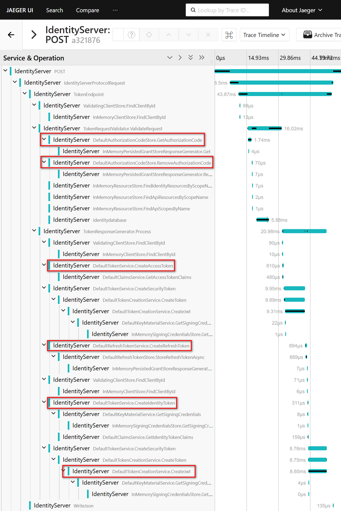

</details>

#### 📊 Jaeger POST 链路

红框区域展示 Jaeger 自动捕获 Test.Api 对 `products.add.queue` 的消息处理过程；即使没有显式日志，`Simulated Delay: 3s` Span 也能呈现长尾延迟。


#### 📊 Jaeger GET 链路


#### 📊 Jaeger DELETE 链路


#### 🔗 Jaeger Trace 关联日志

该截图展示从 Jaeger Trace 直接定位日志条目，连接分布式链路与应用日志以辅助根因分析。


#### 🔄 日志跳转 Jaeger Trace

该截图展示反向关联：从日志条目通过 TraceID 跳转至对应的 Jaeger Trace。


#### 📈 Jaeger Monitor


#### 📊 Grafana OTEL 指标


### 📨 消息队列与告警

**看点：** RabbitMQ Exchange 与 Queue 截图证明产品新增事件已被异步路由和缓冲；Azure Service Bus 截图展示产品更新消息进入 DLQ；Slack 截图证明 RabbitMQ 与 Service Bus 的异常信号可转化为可执行通知。

#### 🔄 RabbitMQ Exchange


#### 📦 RabbitMQ Queue


#### 📢 RabbitMQ Slack 告警消息

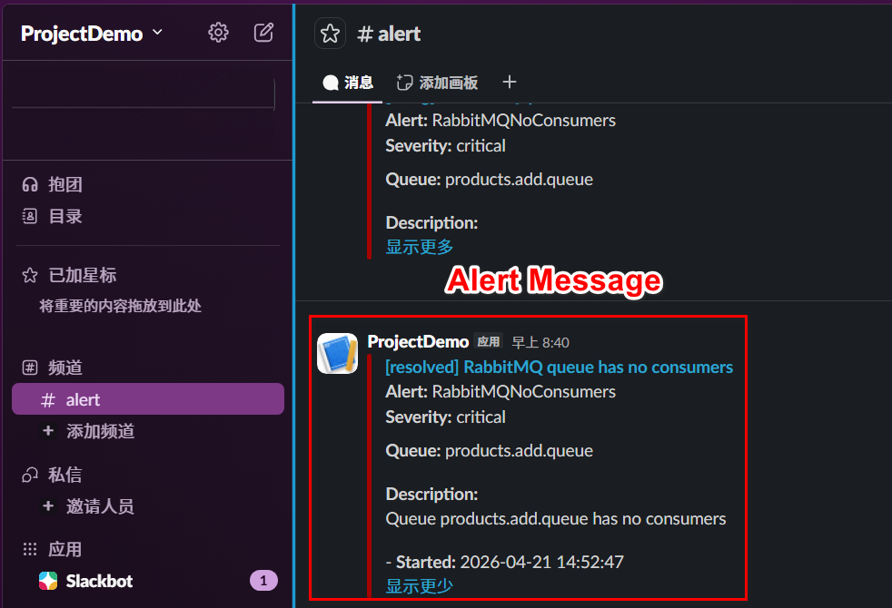

#### 📥 Azure Service Bus Dead-letter Queue

该截图展示进入 Azure Service Bus Subscription DLQ 的产品更新消息，运维人员可据此检查并人工处理死信。

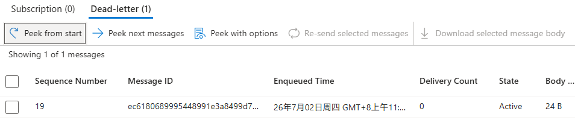

#### 📢 Azure Service Bus Slack 告警消息

该截图展示 Azure Service Bus DLQ 出现消息后触发的 Slack 告警。

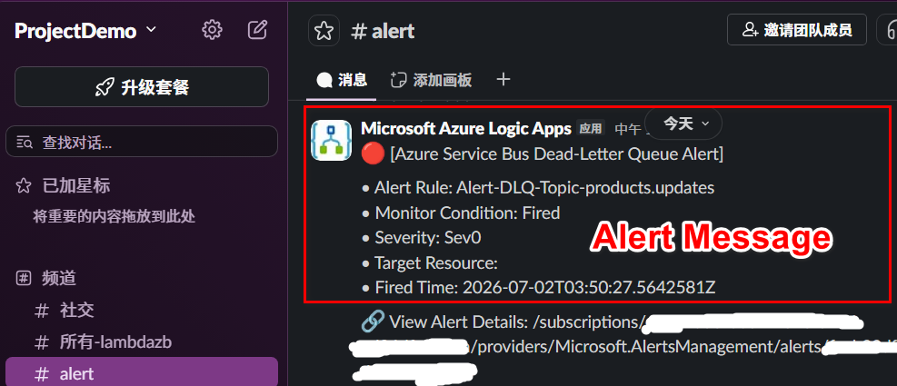

## 🤝 参与贡献

欢迎贡献！提交前请阅读 [CONTRIBUTING.md](CONTRIBUTING.md)，了解分支策略、提交信息格式、代码质量要求与 PR 指南。修改文档时，请同步更新 [英文 README](README.en.md)。

## 📄 许可证

本项目采用 [MIT License](LICENSE)。
